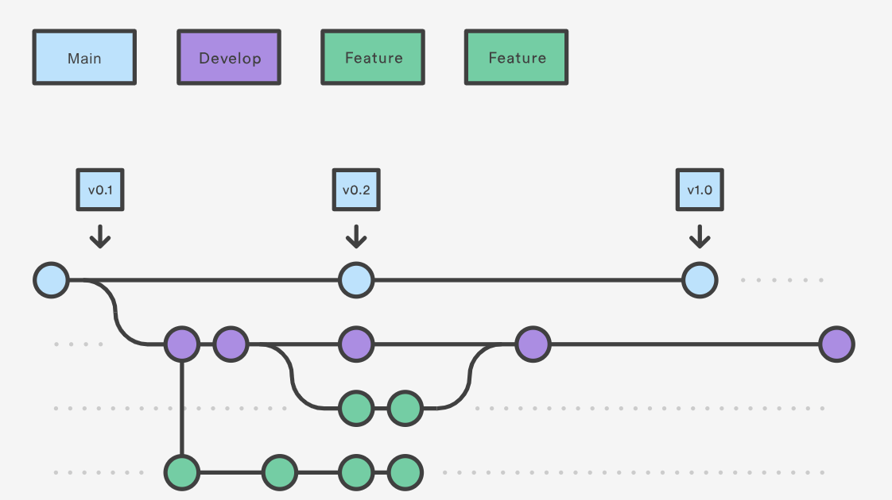
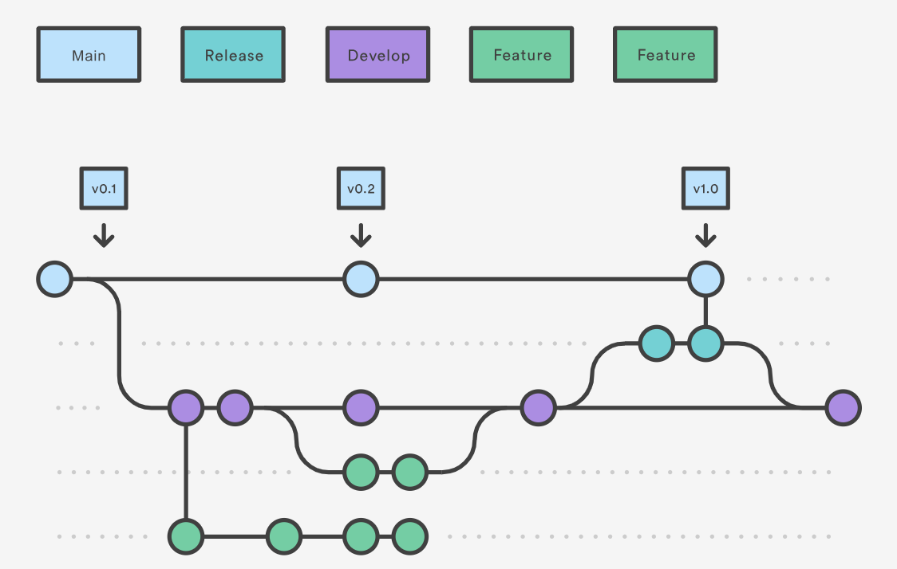
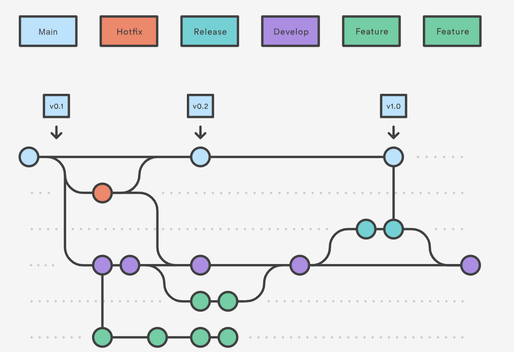

<div class="git-intro">
<div align="center">
    
    <p align="center">
        ARiSTiD design system documentation.
        <br />
        <br />
        <a href="https://storybook.aristid.com/?path=/docs/introduction-wip--docs">View Demo</a>
        ·
        <a href="https://gitlab.aristid.com/dev/design-system/-/issues">Report Bug</a>
        ·
        <a href="https://gitlab.aristid.com/dev/design-system/-/issues">Request Feature</a>
    </p>
</div>

<br/>
<hr>
<details open class="toc-block">
    <summary>Table of Contents</summary>
    <ol>
        <li>
            <a href="#getting-started">Getting Started</a>
            <ul>
                <li>
                    <a href="#prerequisites">Prerequisites</a>
                </li>
                <li>
                    <a href="#installation">Installation</a>
                </li>
                <li>
                    <a href="#usage-in-a-project">Usage in a project</a>
                </li>
            </ul>
        </li>
        <li>
            <a href="#development">Development</a>
            <ul>
                <li>
                    <a href="#code-structure">Code structure</a>
                </li>
                <li>
                    <a href="#creating-a-component">Creating a component</a>
                    <ul>
                        <li>
                            <a href="#component-code">Component code</a>
                        </li>
                        <li>
                            <a href="#component-documentation">Component documentation</a>
                        </li>
                    </ul>
                </li>
                </li>
            </ul>
        </li>
        <li>
            <a href="#contributing">Contributing</a>
            <ul>
                <li>
                    <a href="#commit">Commit</a>
                </li>
                <li>
                    <a href="#gitflow">Gitflow</a>
                    <ul>
                        <li>
                            <a href="#feature">Feature</a>
                        </li>
                        <li>
                            <a href="#release">Release</a>
                        </li>
                        <li>
                            <a href="#hotfix">Hotfix</a>
                        </li>
                    </ul>
                </li>
            </ul>
        </li>
    </ol>
</details>
<hr>
<br/>
<br/>
</div>

## Getting Started
### Prerequisites

* npm

```sh dark
npm install npm@latest -g
```

* yarn

```sh dark
npm install yarn -g
```
<br/>

### Installation

1. Create a folder for this repo

```sh dark
mkdir DESIGN-SYSTEM
```

2. Clone the repo

```sh dark
git clone https://gitlab.aristid.com/dev/design-system.git
```

3. Install requiered packages

```sh dark
yarn install
```

6. Start the application

```sh dark
yarn start
```

7. Once the installation is complete, you can access to the application at http://localhost:6006.

<br/>

### Usage in a project

    ⚠️ TODO :
    - How to import
    - How to use
    - How to use KitApp ?
    - Internationalization / themes (?)

<br/>

## Development

### Code structure


1. 📁 .storybook (💡 Configuration files of Storybook)
2. 📁 src (💡 Design system code)
    - 📁 fonts
    - 📁 icons (💡 Custom icons components)
    -  📁 Kit (💡 Components are in this folder and follow the same structure as in "stories/02-Design System/")
        - 📁 App
        - 📁 DataDisplay
        - 📁 DataEntry
        - 📁 Feedback
        - 📁 General
        - 📁 Layout
    -  📁 theme (💡 Theme variables declaration)
    - index.tsx (💡 Components export)
    -  vite-env.d.ts
3. 📁 stories (💡 Storybook documentation)
    - 📁 01-Design
    - 📁 02-Design System (💡 Components documentation are in this folder)
        - 📁 01-General
        - 📁 02-Layout
        - 📁 03-Navigation
        - 📁 04-DataEntry
        - 📁 05-DataDisplay
        - 📁 06-Feedback
    - 📁 assets
    - 📁 Root
<br/>

### Creating a component
#### Component code

1. Create a new folder for the code of your component

```sh dark
mkdir DESIGN-SYSTEM/src/Kit/DataDisplay/Tooltip
```

2. In this folder create two files

```sh dark
cd Tooltip
touch index.tsx
touch types.d.tsx
```

3. Exemple of `Tooltip/index.tsx`

```tsx dark
import React from 'react';
import {Tooltip as AntdTooltip} from 'antd';
import {KitTooltipProps} from './types';

export const KitTooltip: React.FunctionComponent<KitTooltipProps> = tooltipProps => {
    return <AntdTooltip {...tooltipProps} />;
};

KitTooltip.displayName = 'KitTooltip';
```

4. Exemple of `Tooltip/types.d.ts`

```tsx dark
import {TooltipProps} from 'antd';
import {HTMLAttributes} from 'react';

type AntdTooltipTypesToOmit = 'color' | 'overlayClassName' | 'overlayStyle' | 'overlayInnerStyle';

export interface KitTooltipProps extends Omit<TooltipProps, AntdTooltipTypesToOmit>, HTMLAttributes<HTMLDivElement> {}
```

5. Export your component in `/Kit/05-DataDisplay/index.tsx`

```tsx dark
import {KitTooltip} from './Tooltip';
...
export {KitTooltip};
```

<br/>

#### Component documentation

1. Create a new folder for the documentation of your component

```sh dark
mkdir DESIGN-SYSTEM/stories/02-Design System/05-DataDisplay/Tooltip
```

2. In this folder create two files

```sh dark
cd Tooltip
touch Tooltip.stories.mdx
touch data.tsx
```
- Tooltip.stories.mdx : Contain all your documentation and exemples
- data.tsx : Used mainly for the API section (Args, Template, ...)

3. Create `exemples` for your component

```sh dark
mkdir exemples
cd exemples
touch basic.tsx
touch index.tsx
```
- basic.tsx : Contain your exemple
- index.tsx : Used for export exemples and sources

4. Exemple of `Tooltip/exemples/basic.tsx`

```tsx dark
import React from 'react';
import {KitTooltip} from '@aristid/design-system';

const App = ({}) => {
    return (
        <KitTooltip title="Hey i'm a tooltip">
            Tooltip will show on mouse enter.
        </KitTooltip>
    );
};

export default App;
```
<br/>

5. Exemple of `Tooltip/exemples/index.tsx`

```tsx dark
import Basic from './basic';
import BasicSource from './basic?raw';

export const Sources = {
    Basic: BasicSource
};

export default {
    Basic
};
```

<br/>

6. Exemple of `Tooltip/data.tsx`

```tsx dark
import React from 'react';
import {KitTooltip} from '@aristid/design-system';

export const TooltipArgTypes = {
    title: {
        name: 'title',
        description: 'The text shown in the tooltip',
        control: {type: 'text'},
        table: {
            type: {
                summary: 'ReactNode | () => ReactNode'
            },
            category: 'Tooltip'
        }
    },
    ...
}

export const Template = ({component, ...args}) => {
    return (
        <KitTooltip {...args}>
            Tooltip will show on mouse enter.
        </KitTooltip>
    );
};
```

<br/>

7. Exemple of `Tooltip/Tooltip.stories.mdx`

```tsx dark
import { TooltipArgTypes, Template } from "./data";
import Exemples, { Sources } from './exemples';
import CustomCanvas from '../../../../.storybook/components/CustomCanvas.jsx';

<Meta
    title="Design System/DataDisplay/Tooltip"
    argTypes={TooltipArgTypes}
/>

<CustomCanvas content={Exemples.Basic} source={Sources.Basic} />

<Canvas>
    <Story name="Tooltip">{Template.bind({})}</Story>
</Canvas>

<Controls story="Tooltip" />
```

<br/>

## Contributing

Any contributions you make are **greatly appreciated**. If you have a suggestion that would make this better, please create a pull request. You can also simply open an issue with the appropriate tag to report a bug or inconsistencies in documentation.

### Commit

Commit message must respect the following pattern :

```sh
git commit -m "type[(component)] : message"
```

The type is telling us what change or iteration is being made. We have the following types:

| Type  | Description | Exemple |
|---|---|---|
| test | indicates any type of creation or alteration of test codes | Creation of unit tests |
| feat | indicates the development of a new feature for the project. | Adding a service, functionality, endpoint, etc |
| refactor | used when there is a code refactoring that does not have any impact on the system logic/rules | Code changes after a code review |
| style | used when there are code formatting and style changes that do not change the system in any way | Change the style-guide, change the lint convention, fix indentations, remove white spaces, remove comments, etc… | 
| fix | used when correcting errors that are generating bugs in the system | Apply a handling for a function that is not behaving as expected and returning an error |
| chore | indicates changes to the project that do not affect the system or test files. These are developmental changes | Change rules for eslint, add prettier, add more file extensions to .gitignore |
| docs | used when there are changes in the project documentation | add information in the API documentation, change the README, etc |
| build | used to indicate changes that affect the project build process or external dependencies | add/remove npm dependencies, etc… |
| perf | indicates a change that improved system performance | change ForEach to While, etc… |
| ci | used for changes in CI configuration files | Circle, Travis, BrowserStack, etc… |
| revert | indicates the reversal of a previous commit |


Exemple :

```sh
git commit -m "style(Tooltip) : Change color on hover"
```

📚 Based on this [article](https://dev.to/hornet_daemon/git-commit-patterns-5dm7).

<br/>

### Gitflow

We use Gitflow as Git branching model for this project. We have two branches to record our project history :
- main (💡 Stores the official release history)
- develop (💡 Serves as an integration branch for features)

📚 Based on this [article](https://www.atlassian.com/git/tutorials/comparing-workflows/gitflow-workflow).

#### Feature



Creating a feature branch

```sh
git flow feature start addTooltipComponent
```

Continue your work and use Git like you normally would.

Finishing a feature branch

```sh
git flow feature finish addTooltipComponent
```

#### Release



Creating a release

```sh
git flow release start 0.1.0
```

Finishing a release

```sh
git flow release finish '0.1.0'
```

#### Hotfix



Creating a release

```sh
git flow hotfix start fixTooltip
```

Finishing a release

```sh
git flow hotfix finish fixTooltip
```