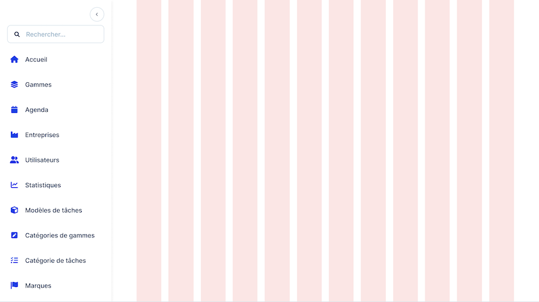

import {Meta} from '@storybook/addon-docs';

<Meta title="Design/Layout" />

# Layout guidelines

This page aims to provide you all the available layout guidelines from Aristid Design System.

## Breakpoints

You can find all of the breakpoints used in Aristid Design System in the table below.

| Name  | Value      | Description                                                           |
| ----- | ---------- | --------------------------------------------------------------------- |
| `xs`  | -          | Extra small devices like phones **smaller than 576px**                |
| `sm`  | **576px**  | Small devices like large phones **between 576px and 768px**           |
| `md`  | **768px**  | Medium devices likelandscape tablets **between 768px and 992px**      |
| `lg`  | **992px**  | Large devices like desktops between **992px and 1200px**              |
| `xl`  | **1200px** | Extra large devices like large desktops **between 1200px and 1600px** |
| `xxl` | **1600px** | Extra large devices like large desktops **larger than 1600px**        |

This is the Javascript object representation of the breakpoints:

```ts
{
  sm: '576px',
  md: '768px',
  lg: '992px',
  xl: '1200px',
  xxl: '1600px',
}
```

## Grid behavior

Depending on the screen size, the grid system will behave differently. Here is a table that shows how many columns are displayed and how large is the gutter on each screen size.

| Screen size | Number of columns | Gutter width |
| ----------- | ----------------- | ------------ |
| `xs`        | 4                 | 8px          |
| `sm`        | 6                 | 8px          |
| `md`        | 8                 | 8px          |
| `lg`        | 12                | 8px          |
| `xl`        | 12                | 16px         |
| `xxl`       | 12                | 16px         |

### Screen sm


### Screen md


### Screen lg


### Screen xl




### Screen xxl


